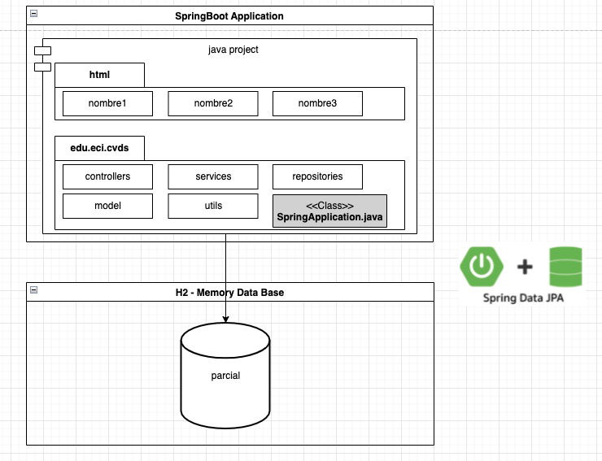

# PARCIAL 2DO TERCIO - CVDS - 2024 - PROYECTO PLANTILLA

## DIAGRAMA DE ARQUITECRURA:

## DIAGRAMA DE PAQUETES:

El proyecto deberá seguir la siguiente estructura de paquetes:

## PRACTICA:

El proyecto deberá seguir la siguiente estructura de paquetes:

- controllers: Paquete contenedor las clases como backing beans para soportar las páginas de JSF.
- services: Paquete contenedor las clases que contienen la lógica de negocio.
- repositories: Paquete contenedor las clases que se comunican con fuentes de datos, 
- model: Paquete contenedor las clases planas (POJOs, Entity) en donde se modelan los objetos del propios del negocio.
- utils: Paquete contenedor de las clases utilitarias que prestan un servicio a las demás capas del proyecto. (Formatters, Mappers, Helpers)

Seguir el siguiente proyecto base: https://github.com/idlm07/cvds-2024-II-parcial-2

### PUNTO 1 - PRACTICO - PUEDEN HABLAR 
Seguiendo la estructura de paquetes del proyecto cree los componentes necesarios para mostrar en una página web las respuestas del parcial teorico.

Para ello deberá crear:
    - UNA TABLA CON SU NOMBRE.
    - UN MODELO PARA EL ORM CON SU NOMBRE
    - CONTROLADORES, CAPA DE SERVICIO, REPOSITORIO CON SU NOMBRE.
    - POR ÚLTIMO, UNA PÁGINA WEB DONDE SE MUESTREN LAS RESPUESTAS A CADA PREGUNTA TRAYENDOLA DE LA BASE DE DATOS.
    - ETC...

### PUNTO 2 - TEORICO - NADIE PUEDE HABLAR
Revisar el parcial teórico en la carpeta: ´docs/´
Subir las respuestas en el archivo ´data.sql´